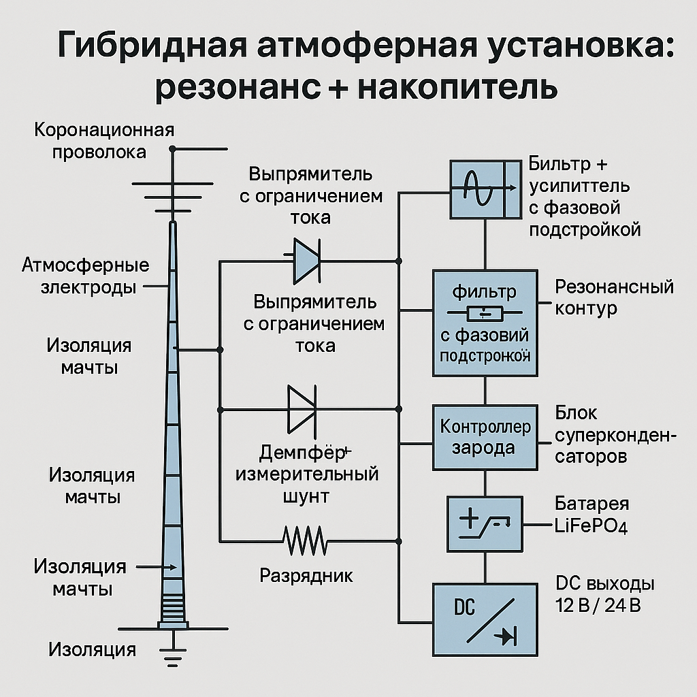

# ⚙️ SvetLuna Hybrid Atmospheric Installation  
*Core research project — 2025*  

---

### 🌩️ Overview
The **Hybrid Atmospheric Installation** is an experimental system designed to capture and store atmospheric electric energy via controlled corona discharge and resonant accumulation.  
The project combines principles of electrical engineering, atmospheric physics, and resonance-based energy modeling.

---

### 🧭 System Schematic
  
*Hybrid atmospheric resonance + accumulator system (schematic).*  
*(Diagram text intentionally kept in Russian to preserve original engineering notation.)*

---

### 🧩 System Architecture
- **Corona wire** — high-voltage emitter for atmospheric ionization  
- **Atmospheric electrodes** — field collectors and charge transfer nodes  
- **Mast insulation** — multi-layer dielectric isolation  
- **Current-limited rectifiers** — safe conversion of atmospheric current  
- **Measuring shunt & damper** — current sensing and protection  
- **Resonance circuit** — frequency-matched phase loop  
- **Charge controller** — regulated energy flow  
- **Supercapacitor block** — fast-response accumulator  
- **LiFePO₄ battery** — long-term storage  
- **DC outputs 12 V / 24 V** — power delivery for loads  

---

### 📘 Documents
| File | Description |
|------|-------------|
| `Gibrid_1.pdf` | General schematic and hybrid circuit diagram |
| `report_text_2.pdf` | Technical report with current-flow modeling |
| `report_content_text5.pdf` | Extended data, parameters, and logs |
| `Final_Tech.pdf` | Technical summary and conclusions |

---

© 2025 **Svetlana Romanova (SvetLuna)**  
Independent researcher — hybrid atmospheric energy systems.
